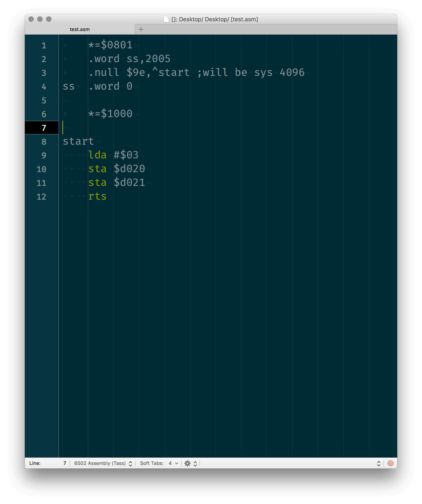
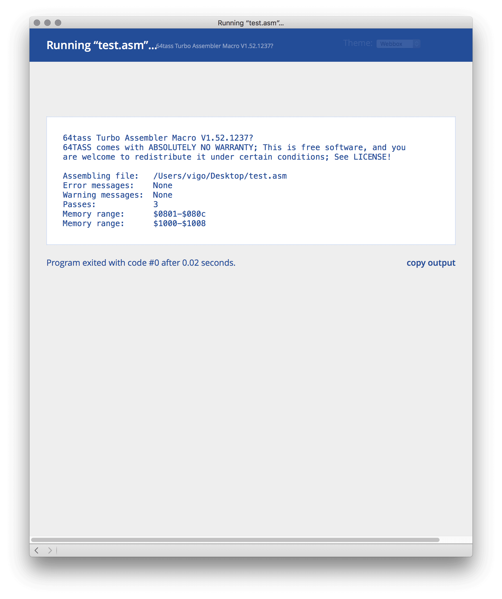
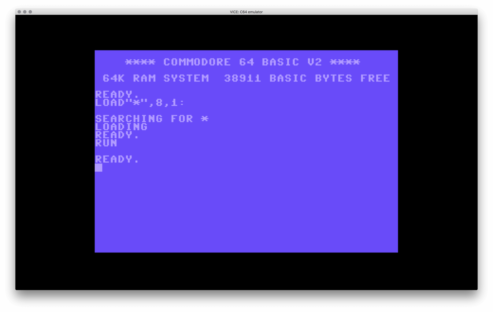

# 64tass Bundle for TextMate 2

If you like to code for Commodore 64 and love TextMate you’ll enjoy this
bundle. [64tass][64tass] is cross assembler targeting the **65xx** series of
micro processors.

Just type your code and hit <kbd>⌘</kbd> + <kbd>R</kbd>

## Installation

    cd ~/Library/Application\ Support/TextMate/Bundles/
    git clone https://github.com/vigo/textmate2-64tass-bundle.git C64Tass.tmbundle

    # Relaunch Textmate

## Todo

* Syntax highlighting and language grammar is work-in-progress now!

## Requirements

* [MacVICE][macvice] or [VICE][vice]
* [64tass compiler][64tass_home] homepage.

[vice]:            http://vice-emu.sourceforge.net/macosx.html
[macvice]:         http://lallafa.de/blog/c64-projects/macvice/
[64tass]:          http://singularcrew.hu/64tass/
[64tass_home]:     http://tass64.sourceforge.net/


## TextMate Setup

You need to set your environment variables. We have one required and two
optional variables.

### Required Variables

**Update**

We don’t need `TM_64TASS_PATH` variable anymore. Just added binary under
`Support/bin/` folder. Current version: **64tass Turbo Assembler Macro V1.52.1237?**

#### `TM_VICE_PATH`

Command-line binary of X64.app. Vice comes with these tools under `tools/`
folder:

    c1541
    cartconv
    petcat
    vice-launcher.sh
    x128
    x64
    x64dtv
    x64sc
    xcbm2
    xcbm5x0
    xpet
    xplus4
    xvic

Example: `/Users/vigo/Applications/MacVice/tools/x64`

```bash
# example from command-line
defaults write com.macromates.textmate environmentVariables -array-add \
    '{enabled = 1; value = "/Users/vigo/Applications/MacVice/tools/x64"; name = "TM_VICE_PATH"; }'
```

### Optional Variables

#### `TM_64TASS_OPTIONS`

Default options are: `-C -a`. You can override it via setting `TM_64TASS_OPTIONS`
variable. You can check the available options for 64tass via `64tass --help`:

    Usage: 64tass [OPTIONS...] SOURCES
    64tass Turbo Assembler Macro V1.52.1237?
    
      -a, --ascii           Source is not in PETASCII
      -B, --long-branch     Automatic bxx *+3 jmp $xxxx
      -C, --case-sensitive  Case sensitive labels
      -D <label>=<value>    Define <label> to <value>
      -E, --error=<file>    Place errors into <file>
      -I <path>             Include search path
      -M <file>             Makefile dependencies to <file>
      -q, --quiet           Do not output summary and header
      -T, --tasm-compatible Enable TASM compatible mode
      -w, --no-warn         Suppress warnings
          --no-caret-diag   Suppress source line display
          
     Diagnostic options:
      -Wall                 Enable most diagnostic warnings
      -Werror               Diagnostic warnings to errors
      -Werror=<name>        Make a diagnostic to an error
      -Wno-error=<name>     Make a diagnostic to a warning
      -Wbranch-page         Warn if a branch crosses a page
      -Wimplied-reg         No implied register aliases
      -Wno-deprecated       No deprecated feature warnings
      -Wno-jmp-bug          No jmp ($xxff) bug warning
      -Wno-label-left       No warning about strange labels
      -Wno-mem-wrap         No offset overflow warning
      -Wno-pc-wrap          No PC overflow warning
      -Wold-equal           Warn about old equal operator
      -Woptimize            Optimization warnings
      -Wshadow              Check symbol shadowing
      -Wstrict-bool         No implicit bool conversions
      
     Output selection:
      -o, --output=<file>   Place output into <file>
      -b, --nostart         Strip starting address
      -f, --flat            Generate flat output file
      -n, --nonlinear       Generate nonlinear output file
      -X, --long-address    Use 3 byte start/len address
          --cbm-prg         Output CBM program file
          --atari-xex       Output Atari XEX file
          --apple-ii        Output Apple II file
          --intel-hex       Output Intel HEX file
          --s-record        Output Motorola S-record file
          
     Target CPU selection:
          --m65xx           Standard 65xx (default)
      -c, --m65c02          CMOS 65C02
          --m65ce02         CSG 65CE02
      -e, --m65el02         65EL02
      -i, --m6502           NMOS 65xx
      -t, --m65dtv02        65DTV02
      -x, --m65816          W65C816
          --mr65c02         R65C02
          --mw65c02         W65C02
          --m4510           CSG 4510
          
     Source listing and labels:
      -l, --labels=<file>   List labels into <file>
          --vice-labels     Labels in VICE format
          --dump-labels     Dump for debugging
      -L, --list=<file>     List into <file>
      -m, --no-monitor      Don't put monitor code into listing
      -s, --no-source       Don't put source code into listing
          --line-numbers    Put line numbers into listing
          --tab-size=<n>    Override the default tab size (8)
          --verbose-list    List unused lines as well
          
     Misc:
      -?, --help            Give this help list
          --usage           Give a short usage message
      -V, --version         Print program version
      
    Mandatory or optional arguments to long options are also mandatory or optional
    for any corresponding short options.
    
    Report bugs to <soci@c64.rulez.org>.

Set it from Terminal:

```bash
# example from command-line
defaults write com.macromates.textmate environmentVariables -array-add \
    '{enabled = 1; value = "YOUR OPTIONS"; name = "TM_64TASS_OPTIONS"; }'
```


#### `TM_VICE_OPTIONS`

You can define extra options for `x64` executable. Try: `x64 -h` for all
options. I’m using `+cart` which is **Disable default cartridge** in my
configurations. It’s totally up to you.

```bash
# example from command-line
defaults write com.macromates.textmate environmentVariables -array-add \
    '{enabled = 1; value = "+cart"; name = "TM_VICE_OPTIONS"; }'
```

---

## Example

Save this file as `~/Desktop/test.asm` and hit <kbd>⌘</kbd> + <kbd>R</kbd>

        * = $0801
        .word ss, 2005
        .null $9e, ^start ;will be sys 4096
    ss    .word 0
    
        * = $1000
        
    start
        lda #$00
        sta $d020
        rts

## Screens







Output theme can be vary according to your preferences.

## Theme Additions

I’ve just added few scope names. Please add these scopes for better syntax
coloring. I’m using **Solarized Dark Theme**

	{	name = '64Tass - Hexadecimal, Dollar Sign';
		scope = 'punctuation.definition.64tass.dollar.sign';
		settings = { foreground = '#ffffff'; };
	},
	{	name = '64Tass - Labels';
		scope = 'entity.name.64tass.label';
		settings = { foreground = '#8C7ECC'; };
	},
	{	name = '64Tass - Comment';
		scope = 'comment.line.semicolon.64tass';
		settings = { background = '#184753'; };
	},
	{	name = '64Tass - Memory Pointer';
		scope = 'punctuation.definition.64tass.star.equals';
		settings = { foreground = '#6a5cdd'; };
	},

---

## Change Log

**2017-07-02**

* `64tass` binary embedded to `Support/bin`
* Added: Example code and screenshot

---

## Contributer(s)

* [Uğur "vigo" Özyılmazel](https://github.com/vigo) - Creator, maintainer

## Contribute

All PR’s are welcome!

1. `fork` (https://github.com/vigo/textmate2-64tass-bundle/fork)
1. Create your `branch` (`git checkout -b my-features`)
1. `commit` yours (`git commit -am 'added killer options'`)
1. `push` your `branch` (`git push origin my-features`)
1. Than create a new **Pull Request**!

## License

This project is licensed under MIT